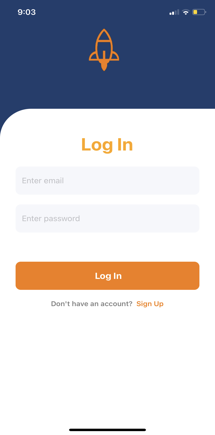
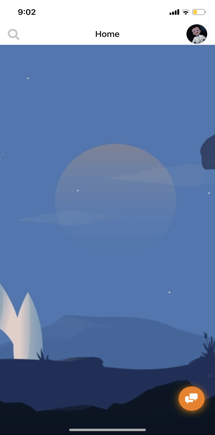
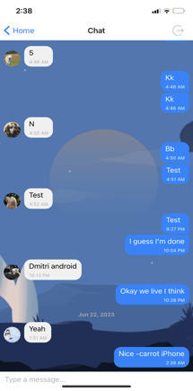
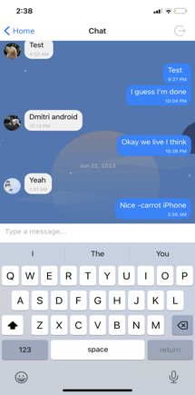

# Mobile Chat App

The Mobile Chat App is a real-time messaging application developed using React Native and powered by Firebase for the backend database. This app enables users to engage in instant communication and exchange messages on their mobile devices.

## App Availability

You can download the app at [App Link](https://expo.dev/@carrot_28/chat-mobile)

## Features

-   Real-time Messaging: Users can send and receive messages in real-time, allowing for seamless and immediate communication.

-   User Authentication: The app includes user authentication functionality, ensuring that only registered users can access the chat features.

-   Secure Backend: Firebase serves as the backend database, offering a secure and reliable infrastructure to store and manage user data and messages.

## Installation

<details>
<summary>
  <code>There are several ways to save this repository on your device. Two of these options include:</code>
</summary>

-   [Downloading repository as ZIP](https://github.com/carrot2803/Mobile-Chat-App/archive/refs/heads/master.zip)
-   Running the following command in a terminal, provided the [GitHub CLI](https://cli.github.com/) has been previously installed:

```sh
git clone https://github.com/carrot2803/Mobile-Chat-App.git
```

<code>Install React and dependencies: </code>

Run the following command to install the required dependencies:

```sh
npm i
```

Run the app: Connect your device or emulator, and run the following command to launch the app:

```sh
npm start
```

</details>

## Usage

Upon launching the Mobile Chat App on your mobile device, you will be presented with the login screen. If you are a new user, you can create an account by providing the required details. Existing users can log in using their credentials. <br/>

Once logged in, you will enter the chat interface, where you can view your conversations, send and receive messages, and interact with other users in real-time. <br/>

## Snippets

Splash Page(Loading Screen)
<br/>

Login Screen
<br/>

Sign Up Screen
<br/>

Home Screen
<br/>

Chat Screen
<br/>

Chat Screen(Keyboard Toggled)
<br/>
